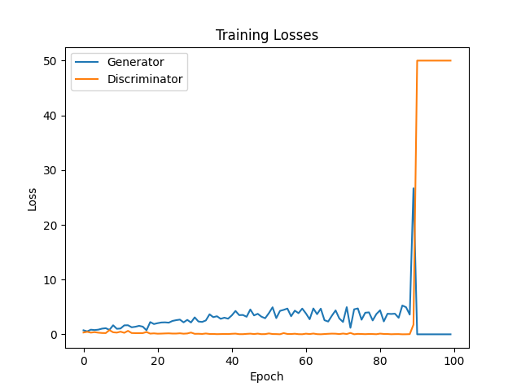
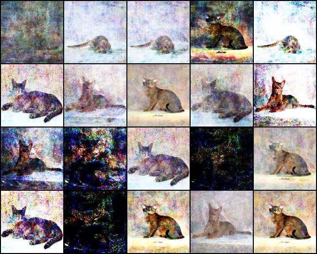
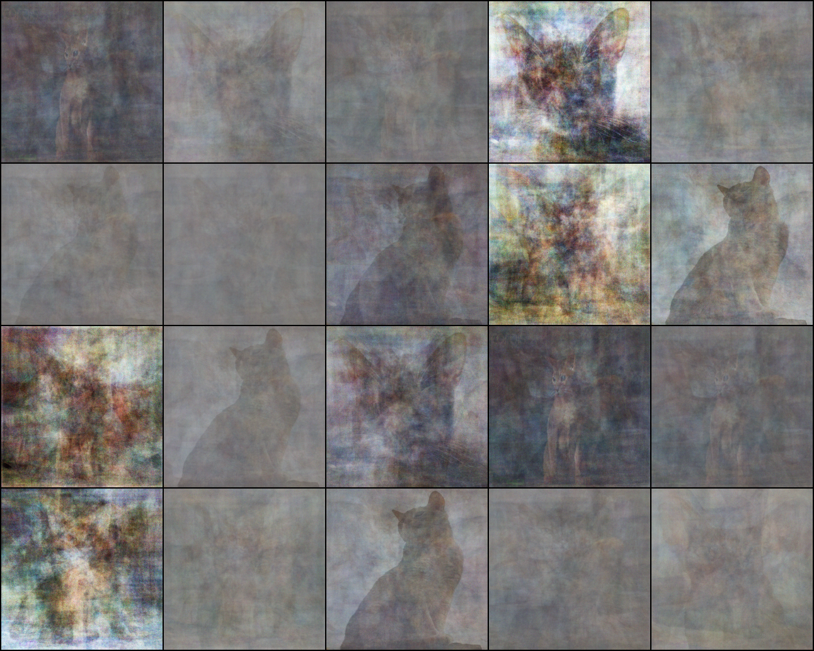

# Отчёт по лабораторной работе
## Свёрточные нейронные сети

### Студент: 

| ФИО       | Роль в проекте                     | Оценка       |
|-----------|------------------------------------|--------------|
| Куценко М.Д. 312 | Выполнил работу |          |

### Ход работы:

Для работы был выбран PyTorch, т.к. для Windows нет новых версий Tensorflow, поддерживающих CUDA (поднятие Tensorflow в WSL2 - муторное занятие).

1. [Faces.ipynb](Faces.ipynb) содержит первую часть работы. Проходимся по папкам, собираем оттуда изображения и даём им отметки. После этого сначала обучаем на основе архитектуры LeNet, потом делаем подбор гиперпараметров.
2. [Pets.ipynb](Pets.ipynb) содержит вторую часть работы. Собираем уникальные имена классов, отбрасывая индексы, и выделяем котов и собак. Обучаем на готовых весах с заменой последнего слоя и заморозкой остальных, выбираем лучшую модель, пробуем поработать с GradCam (не особо удачно).
3. [GAN.ipynb](GAN.ipynb) содержит третью часть работы. Обучаем генератор и дискриминатор для одной породы котов с различными размерами изображений. Для всех размеров наблюдается mode collapse.

- Для 64x64 после большого числа шагов генератор подавил дискриминатор:

- Для 128x128 итоговый результат оказался наилучшим:

- Для 256x256 потенциально необходимо сильно больше шагов:

### Источники:
1. https://www.learnpytorch.io
2. https://github.com/shwars/ai_course/blob/main/04-CV/04-TransferLearning/RoadSignes.ipynb
3. https://github.com/optuna/optuna-examples/blob/main/pytorch/pytorch_simple.py
4. https://github.com/vamsi3/simple-GAN
5. https://www.deepseek.com